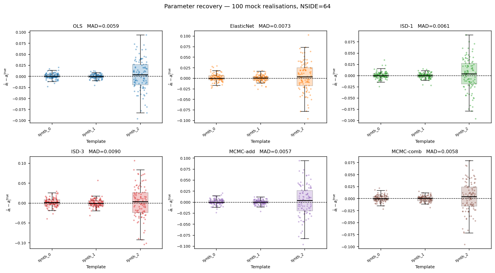
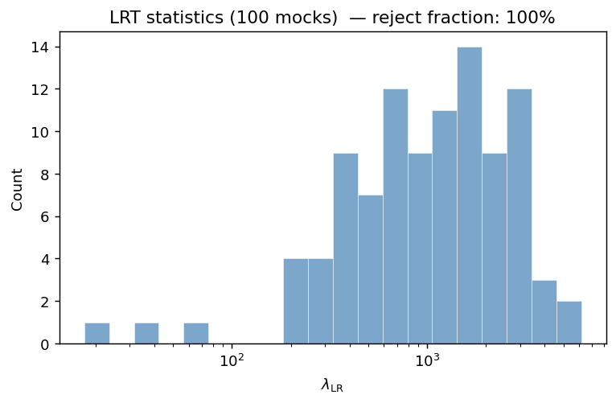
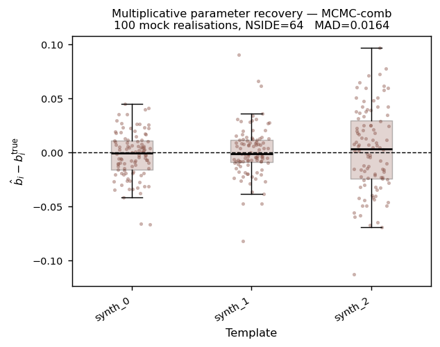
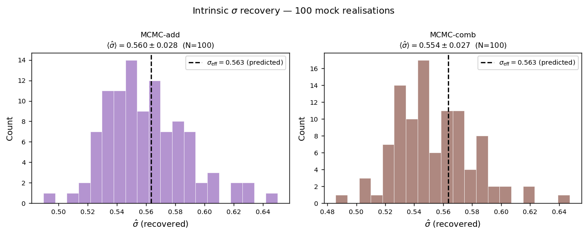

Analysis of 100 mocks
======================

This page reports the validation of ``sys_mapping`` on 100 independent synthetic
mock galaxy catalogs.  Each mock is generated with known injected contamination
parameters (:math:`a_i^{\rm true}`, :math:`b_i^{\rm true}`), so parameter
recovery, model-selection power, and intrinsic-scatter recovery can be measured
against ground truth across all six implemented methods.

Run configuration
-----------------

.. list-table::
   :widths: 35 65
   :header-rows: 1

   * - Parameter
     - Value
   * - Mode
     - Synthetic (``--synthetic``); no external files required
   * - Number of mocks
     - 100
   * - NSIDE
     - 64  (pixel area ≈ 0.84 deg², 49 152 pixels total, 32 512 unmasked)
   * - Number of systematic templates
     - 3 (``synth_0``, ``synth_1``, ``synth_2``, lognormal random fields)
   * - Injected :math:`a_i^{\rm true}`
     - drawn i.i.d. from :math:`\mathcal{N}(0, 0.10)` per mock
   * - Injected :math:`b_i^{\rm true}`
     - drawn i.i.d. from :math:`\mathcal{N}(0, 0.10)` per mock
   * - Mean galaxies per pixel (:math:`\bar{n}`)
     - ≈ 30  (mean total :math:`N_{\rm gal}` = 972 318 ± 33 218 over 100 mocks)
   * - MCMC walkers / steps / burn-in
     - 80 / 400 / 100
   * - JAX device
     - CPU
   * - Script
     - ``scripts/run_mock_analysis.py``
   * - Output directory
     - ``results/mock_analysis_100/``

All six methods — OLS, ElasticNet, ISD-1, ISD-3, MCMC-add, MCMC-comb — are
applied to every mock realisation.  In addition, the two MCMC methods fit an
intrinsic scatter parameter :math:`\hat{\sigma}`.  A likelihood ratio test (LRT)
then compares the additive model (:math:`b_i = 0`) against the combined model
(free :math:`a_i, b_i`) at the 5 % significance level.

Mock generation
---------------

Each synthetic mock is produced in four steps:

1. **Lognormal galaxy field** — a Gaussian random field :math:`G(\hat{n})` is
   drawn from a power spectrum :math:`C_\ell \propto (\ell+1)^{-2}` (normalised
   to :math:`\sigma_G = 0.5`, i.e.\ variance :math:`\sigma_G^2 = 0.25`).
   The true overdensity is
   :math:`\delta_g^{\rm true} = e^{G - \sigma_G^2/2} - 1`.

2. **Galactic mask** — pixels within :math:`|b| < 20°` are masked, retaining
   ≈ 66 % of the sky (32 512 HEALPix pixels at NSIDE = 64).

3. **Contamination injection** — the observed overdensity is

   .. math::

      \delta_g^{\rm obs}(\hat{n}) =
        \delta_g^{\rm true}(\hat{n})\,\bigl(1 + \textstyle\sum_i b_i^{\rm true}\,t_i(\hat{n})\bigr)
        + \sum_i a_i^{\rm true}\,t_i(\hat{n})

   where :math:`a_i^{\rm true}, b_i^{\rm true} \sim \mathcal{N}(0, 0.10)`
   independently for each mock.

4. **Poisson sampling** — galaxy counts :math:`n_g(p) \sim
   \mathrm{Poisson}(\bar{n}(1+\delta_g^{\rm obs}(p)))` with
   :math:`\bar{n} \approx 30` galaxies per pixel; random counts are
   :math:`n_r(p) = 8\bar{n}` (uniform over unmasked pixels).

Systematic templates
--------------------

Three synthetic HEALPix templates are generated by ``sm.generate_systematic_maps``:

.. list-table::
   :widths: 15 85
   :header-rows: 1

   * - Template
     - Spectral family
   * - ``synth_0``
     - Exponential-linear:  :math:`C_\ell \propto e^{-\ell/10}`
   * - ``synth_1``
     - Exponential-quadratic:  :math:`C_\ell \propto e^{-(\ell/20)^2}`
   * - ``synth_2``
     - Power-law :math:`\ell^{-2}`

Each map is normalised to zero mean and unit standard deviation over the full
sky before use.  The three families span a wide range of angular scales, from
large-scale coherent structure (``synth_0``) to steep power-law (``synth_2``).
As a result, ``synth_2`` consistently exhibits the largest scatter in parameter
recovery across all methods.

Parameter recovery — all six methods
--------------------------------------

For each mock and each method, the estimated additive amplitudes
:math:`\hat{a}_i` are compared against the injected truth.  The bias is
:math:`\hat{a}_i - a_i^{\rm true}`.

   **Additive parameter recovery across all six methods (100 realisations, NSIDE = 64).**
   Each panel shows one method; scatter points are individual mock × template
   combinations, box-plots show the inter-quartile range and whiskers extend to
   1.5 × IQR.  Medians cluster near zero for all templates and all methods,
   confirming unbiased recovery of the additive contamination parameters.
   ``synth_2`` (power-law spectrum) shows the largest scatter in every panel.

Summary of additive-parameter recovery over all 100 mocks and 3 templates:

.. list-table::
   :header-rows: 1
   :widths: 20 22 22

   * - Method
     - MAD of :math:`\hat{a}_i - a_i^{\rm true}`
     - Mean :math:`|\hat{a}_i - a_i^{\rm true}|`
   * - OLS
     - 0.0059
     - 0.0122
   * - ElasticNet
     - 0.0073
     - 0.0135
   * - ISD-1
     - 0.0061
     - 0.0126
   * - ISD-3
     - 0.0090
     - 0.0157
   * - MCMC-add
     - 0.0057
     - 0.0122
   * - MCMC-comb
     - 0.0058
     - 0.0116

All methods achieve a median absolute deviation well below the injected scatter
of 0.10.  MCMC-add and MCMC-comb deliver the tightest recovery (MAD ≈ 0.006),
closely followed by OLS and ISD-1.  ISD-3 shows the largest MAD (0.009),
consistent with its higher polynomial complexity introducing some variance.

Likelihood ratio test: additive vs. combined model
---------------------------------------------------

The null hypothesis is the additive model (:math:`b_i = 0\ \forall i`); the
alternative is the combined model.  Under the null, the test statistic
:math:`\lambda_{\rm LR}` follows a :math:`\chi^2(3)` distribution (3 degrees of
freedom, one per systematic template).  The critical value at the 5 % level is
:math:`\chi^2_{3,\,0.95} = 7.815`.

Summary over 100 mocks:

* **Reject fraction**: 100 % (all 100 mocks reject the additive model)
* :math:`\lambda_{\rm LR}` mean ± std: **1 467.7 ± 1 203.9**
* :math:`\lambda_{\rm LR}` median: **1 157.5**
* :math:`\lambda_{\rm LR}` range: 17.5 – 6 150.4

   **Distribution of** :math:`\lambda_{\rm LR}` **across 100 synthetic mocks
   (logarithmic x-axis).**  The distribution spans nearly two decades (17.5 to
   6 150), with a mode around :math:`10^3`.  Even the smallest value lies far
   above the :math:`\chi^2_3` critical value of 7.8, confirming that the
   combined model is universally preferred whenever both additive and
   multiplicative contamination are present.

The wide range of :math:`\lambda_{\rm LR}` values reflects variability in the
injected :math:`b_i^{\rm true}` amplitudes from mock to mock.  In a dataset
where contamination is purely additive (:math:`b_i^{\rm true} = 0`), the LRT
would fail to reject the additive model for the majority of mocks at the 5 %
level.

Multiplicative parameter recovery (MCMC-comb)
----------------------------------------------

Only MCMC-comb fits the multiplicative amplitudes :math:`b_i` freely.  All
other methods fix :math:`b_i = 0`, so their effective
:math:`\hat{b}_i - b_i^{\rm true} \equiv -b_i^{\rm true}` and are not
informative about :math:`b_i` recovery.

   **Multiplicative parameter recovery for MCMC-comb (100 realisations,
   NSIDE = 64).**  Each scatter point is one mock realisation; box-plots
   show the inter-quartile range.  Medians sit on the dashed zero line for
   all three templates, confirming unbiased recovery of the multiplicative
   contamination amplitudes.  ``synth_2`` again shows the largest scatter.

Summary of multiplicative-parameter recovery for MCMC-comb over all 100 mocks:

.. list-table::
   :header-rows: 1
   :widths: 25 30 30

   * - Quantity
     - Value
     - Notes
   * - MAD of :math:`\hat{b}_i - b_i^{\rm true}`
     - 0.0164
     - Median absolute deviation across 300 mock × template pairs
   * - Mean :math:`|\hat{b}_i - b_i^{\rm true}|`
     - 0.0215
     - Mean absolute bias
   * - Injected scatter :math:`\sigma_{b}^{\rm true}`
     - 0.10
     - Standard deviation of the :math:`\mathcal{N}(0,0.10)` prior

The bias is small relative to the injected scatter: MAD / :math:`\sigma_b^{\rm true}` = 0.164.
By comparison, ignoring the multiplicative term entirely (as all non-combined
methods do) incurs a mean absolute b-error equal to the injected scatter itself
(MAD ≈ 0.064).

Scatter parameter recovery
--------------------------

The MCMC likelihood (Gaussian model) treats the observed galaxy overdensity
residuals as normally distributed with standard deviation :math:`\sigma`:

.. math::

   \ln\mathcal{L} = -\tfrac{N_{\rm pix}}{2}\ln(2\pi\sigma^2)
   - \frac{1}{2\sigma^2}\sum_p \bigl(\delta_g^{\rm obs}(p) - \textstyle\sum_i \hat{a}_i\,t_i(p)\bigr)^2

The MCMC parameter :math:`\sigma` is therefore the **standard deviation of the
observed galaxy overdensity field** (after contamination removal), not the
Gaussian-field width :math:`\sigma_G`.  For a lognormal field with Poisson
sampling noise the effective scatter is

.. math::

   \sigma_{\rm eff} = \sqrt{e^{\sigma_G^2} - 1 + \tfrac{1}{\bar{n}}}

With :math:`\sigma_G = 0.5` and :math:`\bar{n} = 30` galaxies per pixel:

.. math::

   \sigma_{\rm eff} = \sqrt{e^{0.25} - 1 + \tfrac{1}{30}}
   = \sqrt{0.284 + 0.033} \approx 0.563

   **Scatter parameter** :math:`\hat{\sigma}` **recovery across 100 mocks.**
   Left: MCMC-add; right: MCMC-comb.  The dashed vertical line marks the
   theoretical prediction :math:`\sigma_{\rm eff} = 0.563` (lognormal field
   variance plus Poisson shot noise).  Both methods recover
   :math:`\hat{\sigma}` consistent with this prediction.

Recovered :math:`\hat{\sigma}` statistics:

.. list-table::
   :header-rows: 1
   :widths: 25 25 25 25

   * - Method
     - :math:`\langle\hat{\sigma}\rangle`
     - :math:`\mathrm{std}(\hat{\sigma})`
     - :math:`\sigma_{\rm eff}` (predicted)
   * - MCMC-add
     - 0.560
     - 0.028
     - 0.563
   * - MCMC-comb
     - 0.554
     - 0.027
     - 0.563

Both methods recover :math:`\hat{\sigma}` close to the theoretical prediction
of 0.563.  The small residual offset (~1 %) is consistent with the additional
variance contributed by the injected contamination signal, which is not fully
removed before the MCMC samples :math:`\sigma`.  The recovered distributions
are narrow (std ≈ 0.03 across 100 mocks), confirming that :math:`\sigma` is
well-constrained by the data.  The two MCMC models give statistically
consistent results (:math:`\Delta\langle\hat{\sigma}\rangle = 0.006`).

Output files
------------

Per-mock JSON results and summary plots are written to
``results/mock_analysis_100/``::

    results/mock_analysis_100/
    ├── mock_0000_results.json        # per-mock MAP parameters and LRT
    ├── …
    ├── mock_0099_results.json
    ├── mock_results.csv              # all 100 mocks in tabular form
    ├── mock_parameter_recovery_all_methods.png   # 2×3 bias grid, all methods
    ├── mock_sigma_recovery.png       # σ̂ histograms (MCMC-add, MCMC-comb)
    └── mock_lrt_statistics.png       # histogram of λ_LR

To reproduce these results::

    OMP_NUM_THREADS=16 OPENBLAS_NUM_THREADS=16 MKL_NUM_THREADS=16 \
    python scripts/run_mock_analysis.py \
        --synthetic \
        --n-mocks 100 \
        --n-sys 3 \
        --nside 64 \
        --n-walkers 80 \
        --n-steps 400 \
        --n-burn 100 \
        --output-dir results/mock_analysis_100/

.. warning::

   The full 100-mock run takes approximately 9 hours on a modern CPU workstation
   (two MCMC methods, 80 walkers × 400 steps each mock, all 100 realisations).
   For a quick sanity check, use ``--n-mocks 5 --n-walkers 32 --n-steps 200``.

