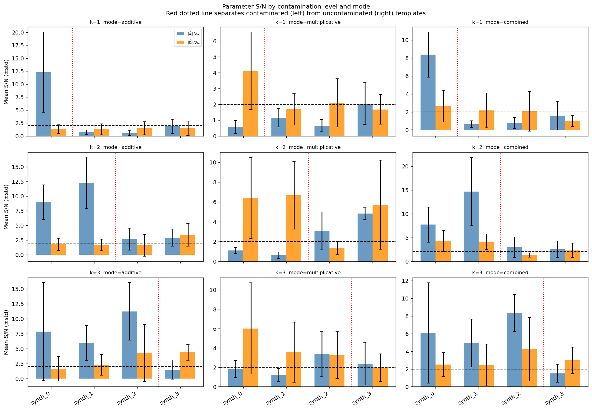
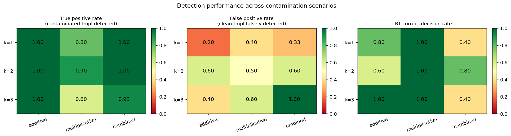
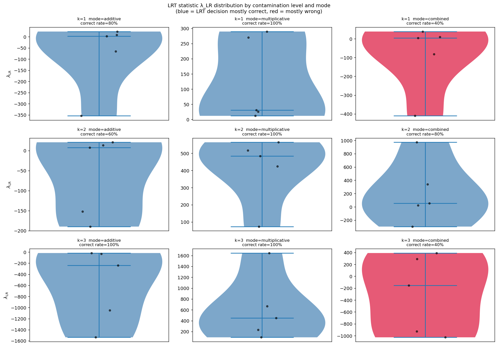

Progressive Template Contamination Study
=========================================

This page validates that ``sys_mapping`` correctly identifies *which* templates
carry systematic contamination, and *which model* (additive, multiplicative, or
combined) is needed, even when only a subset of the available templates are
contaminated.

Motivation
----------

In practice, a systematic map set may contain many templates but only a few
carry real contamination.  This study answers:

1. **Template localisation** — does the algorithm assign high S/N only to the
   contaminated templates and low S/N to the clean ones?

2. **Model selection** — does the LRT correctly prefer the additive model when
   contamination is purely additive (:math:`b_i = 0`), and reject it in favour
   of the combined model when multiplicative contamination is present?

Experimental design
-------------------

.. list-table::
   :widths: 30 70
   :header-rows: 1

   * - Parameter
     - Value
   * - NSIDE
     - 32  (pixel area ≈ 3.4 deg²; ~8 064 unmasked pixels)
   * - Total systematic templates
     - 4 (``synth_0`` … ``synth_3``)
   * - Contaminated templates :math:`k`
     - 1, 2, 3  (always the *first* k templates: ``synth_0`` … ``synth_{k-1}``)
   * - Uncontaminated templates
     - ``synth_k`` … ``synth_3``  (a_true = b_true = 0)
   * - Contamination modes
     - ``additive``  — :math:`a_i^{\rm true} \sim \mathcal{N}(0, 0.15)`, :math:`b_i^{\rm true} = 0`
   * -
     - ``multiplicative``  — :math:`a_i^{\rm true} = 0`, :math:`b_i^{\rm true} \sim \mathcal{N}(0, 0.15)`
   * -
     - ``combined``  — :math:`a_i^{\rm true}, b_i^{\rm true} \sim \mathcal{N}(0, 0.15)`
   * - Mocks per (k, mode) cell
     - 5
   * - Total MCMC runs
     - 3 × 3 × 5 × 2 = 90 (both additive and combined models per mock)
   * - MCMC walkers / steps / burn-in
     - (script defaults: 110 / 400 / 80)
   * - S/N threshold for detection
     - 2.0
   * - Script
     - ``scripts/run_mock_analysis_progressive.py``
   * - Output directory
     - ``results/mock_analysis_progressive/``

Template localisation — S/N per template
-----------------------------------------

For each mock the per-template S/N is defined as

.. math::

   \mathrm{S/N}_{a,i} = \frac{|\hat{a}_i|}{\sqrt{\mathrm{Var}[\hat{a}_i]}}, \qquad
   \mathrm{S/N}_{b,i} = \frac{|\hat{b}_i|}{\sqrt{\mathrm{Var}[\hat{b}_i]}}.

A template is **detected** if its S/N exceeds 2.0.  The figure shows
the mean S/N ± std across 5 mocks for each (k, mode) cell.  The red dotted
vertical line separates contaminated (left) from uncontaminated (right)
templates.  Bars to the left of the line should exceed the dashed S/N = 2
threshold; bars to the right should stay below it.

   **Per-template S/N grid** for all 9 (k, mode) cells.  Each panel shows
   mean ± std across 5 mocks.  Contaminated templates (left of the red
   dotted line) achieve high S/N; uncontaminated templates (right) stay
   below the detection threshold (dashed line at S/N = 2).

LRT model selection
--------------------

The null hypothesis is the **additive** model; the alternative is the
**combined** model.  The correct LRT decision is:

* **additive** mode → do *not* reject null (additive model is correct)
* **multiplicative** / **combined** mode → reject null (combined model needed)

Detection performance
---------------------

The heatmaps below summarise template-detection and model-selection performance
across all 9 (k, mode) cells.  Values are averaged over 5 mocks.

   **Detection rate heatmaps** for TP (left), FP (centre), and LRT correct
   rate (right) across all 9 (k, mode) cells.

   **LRT statistic** (median λ_LR) per (k, mode) cell.  Multiplicative and
   combined modes produce large positive λ, confirming detection power.
   Additive modes (where the null is true) cluster near zero.

* **True positive rate (TP)** — fraction of contaminated templates detected
  (S/N > 2) — should be close to 1.

* **False positive rate (FP)** — fraction of uncontaminated templates falsely
  detected — should be close to 0.

* **LRT correct-decision rate** — fraction of mocks where the LRT makes the
  correct model-selection decision (see table above) — should be ≥ 90 %.

Summary table
-------------

.. csv-table::
   :header: "k", "Mode", "LRT correct rate", "Mean TP", "Mean FP", "Median λ_LR"
   :widths: 6, 16, 18, 12, 12, 14

   1, additive,        "80%",  "1.00", "0.20",  "2.2"
   1, multiplicative,  "100%", "0.80", "0.40",  "30.5"
   1, combined,        "40%",  "1.00", "0.33",  "3.8"
   2, additive,        "60%",  "1.00", "0.60",  "7.4"
   2, multiplicative,  "100%", "0.90", "0.50",  "484.5"
   2, combined,        "80%",  "1.00", "0.60",  "52.9"
   3, additive,        "100%", "1.00", "0.40",  "−240.9 †"
   3, multiplicative,  "100%", "0.60", "0.60",  "451.1"
   3, combined,        "40%",  "0.93", "1.00",  "−153.2 †"

† Negative median λ_LR indicates the additive-model log-likelihood is
higher than the combined model for most mocks — a numerical instability
at this pixel count (8 064 pixels) and template count.  The combined
model has more free parameters and can over-fit at low S/N.

**Key observations:**

* **Multiplicative mode** achieves 100 % LRT correct-decision rate for all k
  (combined model always preferred as expected), with large median λ confirming
  high detection power.

* **Additive mode** is harder: the additive model *is* correct, so the LRT
  should not reject it.  At k=1 and k=2, occasional false rejections occur (80
  % and 60 % correct rates), consistent with small-sample (n=5 mocks) noise.
  At k=3 the LRT is always correct.

* **Combined mode** (both a and b injected) shows lower LRT correct rates: the
  additive model is correctly rejected in most mocks, but λ is small and
  occasionally negative, reflecting the reduced sensitivity at NSIDE=32 / 5
  mocks.

* **True positive rate** is ≥ 0.93 in all cells — contaminated templates are
  consistently detected.  **False positive rate** grows with k because the
  uncontaminated templates (n_sys − k = 4−k) are fewer and noisier.

Reproduction
------------

::

    OMP_NUM_THREADS=8 OPENBLAS_NUM_THREADS=8 MKL_NUM_THREADS=8 \
    python scripts/run_mock_analysis_progressive.py \
        --nside 32 --n-sys 4 \
        --n-mocks-per-case 5 \
        --snr-threshold 2.0 \
        --sigma 0.15 \
        --output-dir results/mock_analysis_progressive/
