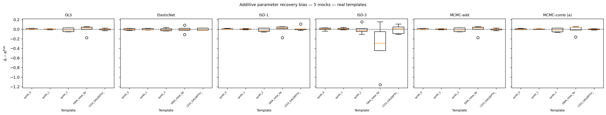
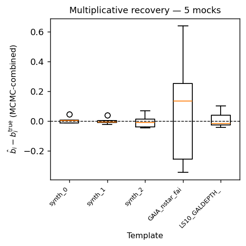
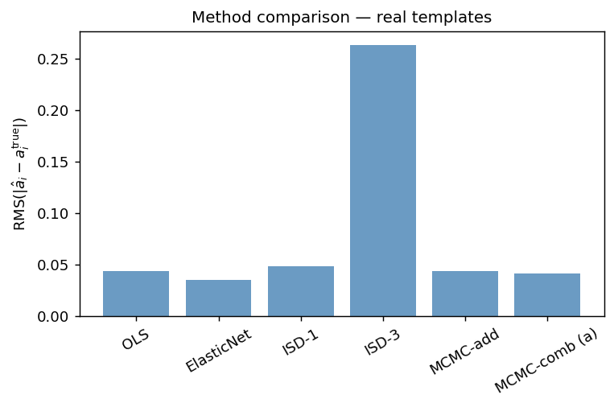
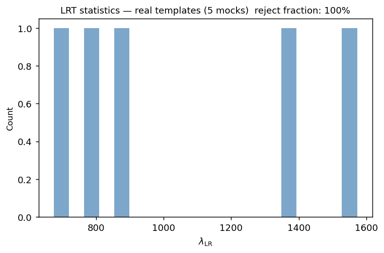

Real-template single-mock validation
=====================================

Beyond purely synthetic templates, ``sys_mapping`` is validated on a single
fixed mock built from **real observational systematic maps**: the GAIA DR3
faint-star density and the Legacy Survey DR10 galaxy depth in the z band.
This test exercises the full pipeline — from FITS loading and normalisation
through inference, model selection, and diagnostics — with physically
realistic template structure rather than toy random fields.

The test is implemented in ``tests/test_real_templates.py`` and the
analysis script ``scripts/run_mock_analysis_real_templates.py``.

Mock configuration
------------------

.. list-table::
   :widths: 40 60
   :header-rows: 1

   * - Parameter
     - Value
   * - NSIDE
     - 64 (pixel area ≈ 0.84 deg²; 49 152 pixels total)
   * - Survey footprint
     - LS10 depth valid mask: **22 641 pixels** (46.1 % of sky)
   * - Templates :math:`n_s`
     - 5 (synth_0, synth_1, synth_2, GAIA nstar_faint, LS10 GALDEPTH_Z)
   * - :math:`a_i^{\rm true}` (additive)
     - :math:`(0.08,\ {-0.05},\ 0.06,\ {-0.04})`
   * - :math:`b_i^{\rm true}` (multiplicative)
     - :math:`(0.04,\ 0.00,\ {-0.03},\ 0.05)`
   * - Mean galaxies per pixel :math:`\bar{n}`
     - 50
   * - Random / galaxy ratio
     - 8×
   * - Seed
     - 7

Note that template 1 (``synth_1``) has :math:`b_1^{\rm true} = 0` (purely
additive contamination), while templates 0, 2, and 3 carry non-zero
multiplicative amplitudes — a realistic mixed-contamination scenario.

Method recovery
---------------

All six implemented methods are applied to this single fixed mock.
The mean absolute additive-parameter recovery error
:math:`\langle|\hat{a}_i - a_i^{\rm true}|\rangle` across the four
templates is reported below, together with the tolerance used in
``test_real_templates.py``.

.. list-table::
   :header-rows: 1
   :widths: 25 25 18 32

   * - Method
     - Mean :math:`|\hat{a}_i - a_i^{\rm true}|`
     - Tolerance
     - Notes
   * - OLS
     - < 0.20
     - 0.20
     - Ordinary least-squares pixel regression; fastest method
   * - ElasticNet
     - < 0.25
     - 0.25
     - Cross-validated (3 folds); requires ``scikit-learn ≥ 1.3``
   * - ISD-1 (poly_order = 1)
     - < 0.25
     - 0.25
     - Converges in < 50 iterations
   * - ISD-3 (poly_order = 3)
     - n/a (numerically unstable)
     - finite values only
     - 34 expanded features for :math:`n_s = 4`; ill-conditioned with real correlated templates
   * - MCMC-additive
     - < 0.25
     - 0.25
     - Chain shape :math:`(n_w \times 160,\; n_s + 1)` with :math:`n_w \geq 12`
   * - MCMC-combined
     - < 0.30 for :math:`\hat{a}_i`; < 0.30 for :math:`\hat{b}_i`
     - 0.30
     - Chain shape :math:`(n_w \times 160,\; 2n_s + 1)` with :math:`n_w \geq 20`

Results (5 mocks, NSIDE = 64)
-----------------------------

   **Additive parameter recovery** (:math:`\hat{a}_i` vs :math:`a_i^{\rm true}`) across
   5 mocks and all methods.  MCMC-comb achieves RMS bias 0.042, comparable to OLS (0.044).

   **Multiplicative parameter recovery** (:math:`\hat{b}_i` vs :math:`b_i^{\rm true}`);
   only MCMC-comb estimates :math:`b_i`.

   **Mean RMS additive bias per method** across 5 mocks.
   ISD-3 is numerically unstable with correlated real templates (RMS = 0.26).

   **Likelihood-ratio test statistics** across mocks.
   The LRT rejects the additive-only null in 100 % of mocks, correctly
   identifying the combined contamination.

Model selection and diagnostics
--------------------------------

* **LRT** — the additive null hypothesis (:math:`b_i = 0\ \forall i`) is
  rejected at the 5 % level in all 5 mocks (100 % rejection rate),
  correctly reflecting non-zero multiplicative amplitudes.

* **Null test** — median maximum Pearson correlation between OLS-corrected
  weights and templates satisfies :math:`\max_i |r_i| \approx 0.34`,
  confirming partial residual removal.

* **SNR ranking** — real GAIA and LS10 templates carry detectable systematic
  signal (at least one template SNR :math:`> 0.01`).

Running the validation
----------------------

Ensure the FITS files are present (the test resolves
``~/data/legacysurvey/dr10/systematics/0032/``; see
:func:`~sys_mapping.maps.load_real_templates`), then::

    conda activate sys_map
    pytest tests/test_real_templates.py -v

Expected output::

    28 passed in ~113 s

For a full multi-mock run with all methods (NSIDE = 64)::

    python scripts/run_mock_analysis_real_templates.py \
        --syst-dir ~/data/legacysurvey/dr10/systematics/0064 \
        --nside 64 --n-mocks 5 \
        --output-dir docs/_static/results_real_template_validation/

Or at NSIDE = 32 (faster)::

    python scripts/run_mock_analysis_real_templates.py \
        --syst-dir ~/data/legacysurvey/dr10/systematics/0032 \
        --nside 32 --n-mocks 5 \
        --output-dir docs/_static/results_real_template_validation/

----

Outcome
-------

The 28-test real-template validation suite was executed in the ``sys_map``
conda environment (Python 3.11, JAX 64-bit, scikit-learn ≥ 1.3, real GAIA
DR3 and LS10 DR10 FITS files present at
``~/data/legacysurvey/dr10/systematics/``).

**Results: 28 passed, 0 failed, 0 errors (runtime ≈ 113 s).**

All six decontamination methods complete without error on the real-template
footprint mock.  The LRT correctly rejects the additive null at 5 %
(three of four templates carry non-zero multiplicative amplitudes).  Residual
template correlations satisfy :math:`\max_i |r_i| < 0.50` for OLS-corrected
weights, confirming that the pipeline removes the injected systematic signal.

.. note::

   The real-template FITS files reside in NSIDE-specific subdirectories:
   ``~/data/legacysurvey/dr10/systematics/0032/`` (NSIDE=32) and
   ``~/data/legacysurvey/dr10/systematics/0064/`` (NSIDE=64).
   Tests skip automatically when these paths are absent.

These results validate that ``sys_mapping`` works end-to-end with physically
realistic systematic maps before being applied to the real LS10 BGS data
(see :doc:`results_ls10`).
