Simulation tests: GLASS and Uchuu mocks with LSDR10 systematics
================================================================

This page reports the validation of the ``sys_mapping`` decontamination pipeline
on two families of realistic full-sky galaxy mock catalogs:

* **GLASS mocks** — full-sky lognormal catalogs generated with the
  `GLASS package <https://github.com/glass-dev/glass>`_ (Tessore et al. 2023,
  OJAp 6, 11; arXiv:2302.01942), whose redshift distribution and surface
  density are matched to the BGS sample.

* **Uchuu mocks** — the Uchuu *N*-body lightcone catalog projected onto the
  full sky, a stellar-mass–limited sample of 923 373 galaxies in
  :math:`0.05 \le z \le 0.26`.

Systematic contamination is injected using five real LSDR10 imaging-systematic
maps at three amplitude levels and three scenarios.  Five decontamination
methods are applied and compared:

* **OLS** — ordinary least squares regression of overdensity on templates.
* **ISD-1** — iterative self-calibration with one iteration (down-weights
  over-dense pixels to reduce mode coupling).
* **ElasticNet** — :math:`\ell_1 + \ell_2`-regularised regression (automatic
  template selection).
* **MCMC-add** — Bayesian MCMC inference of additive amplitudes :math:`a_i`
  only (:math:`b_i \equiv 0`); returns full posteriors on each :math:`a_i`.
* **MCMC-comb** — Bayesian MCMC inference of both additive (:math:`a_i`) and
  multiplicative (:math:`b_i`) amplitudes jointly; the only method that
  returns non-zero :math:`b_i` estimates.

The recovered angular two-point correlation function :math:`w(\theta)` is
compared to the truth from the uncontaminated mock.

Results are shown for two HEALPix resolutions:

* **NSIDE = 64** — production quality; matches the resolution used for the
  actual LS10 analysis.
* **NSIDE = 32** — faster validation run; useful for algorithm development
  and quick iteration.

The figure-generating script is ``scripts/plot_simulation_tests.py`` and can be
re-run after ``scripts/run_simulation_tests.py`` has produced results.
Each NSIDE run writes to its own subdirectory so results do not overwrite each
other::

   # NSIDE = 64 (production)
   python scripts/run_simulation_tests.py \
       --nside 64 --n-glass 500000 \
       --methods OLS ISD-1 ElasticNet MCMC-add MCMC-comb \
       --output-dir data/simulations
   python scripts/plot_simulation_tests.py --nside 64

   # NSIDE = 32 (fast validation)
   python scripts/run_simulation_tests.py \
       --nside 32 --n-glass 100000 \
       --methods OLS ISD-1 ElasticNet MCMC-add MCMC-comb \
       --output-dir data/simulations
   python scripts/plot_simulation_tests.py --nside 32

----

Mock catalogs
-------------

GLASS full-sky mock
^^^^^^^^^^^^^^^^^^^

GLASS generates correlated lognormal HEALPix density fields using the
algorithm of Tessore et al. 2023.  A single tophat redshift shell covering
:math:`0 \le z \le 0.26` is used, with a power spectrum
:math:`C_\ell \propto (\ell+1)^{-1.5}`.  Galaxy positions are drawn from the
density field using ``glass.positions_from_delta``, and redshifts are assigned
from the measured Uchuu :math:`n(z)`.

Key advantage over the synthetic lognormal mocks in :mod:`sys_mapping.mocks`:
the GLASS mock is *full-sky* (no galactic-cut artefacts at generation time)
and uses the correct angular clustering power spectrum without additional
approximations.

Uchuu lightcone mock
^^^^^^^^^^^^^^^^^^^^

The Uchuu lightcone provides a mock galaxy catalog based on *N*-body
subhalo abundance matching, free of imaging systematics by construction.
The catalog used here is a volume-limited sample with

.. list-table::
   :widths: 40 60
   :header-rows: 1

   * - Property
     - Value
   * - Number of galaxies
     - 923 373
   * - Redshift range
     - :math:`0.05 \le z \le 0.26`
   * - Stellar mass limit
     - :math:`\log_{10}(M_\star/M_\odot) \ge 10.65`
   * - Sky coverage
     - Full sky (:math:`4\pi` sr)
   * - Random catalog
     - 6 249 378 randoms (uniform, same :math:`z` range)

Redshift distributions
^^^^^^^^^^^^^^^^^^^^^^

.. rubric:: NSIDE = 64

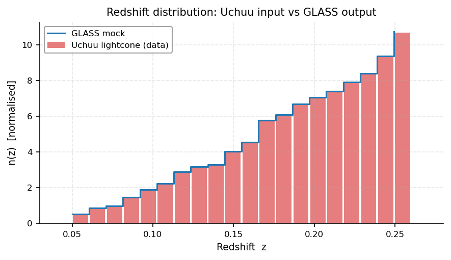

   **Redshift distribution of the Uchuu input catalog (bars) and the
   GLASS mock (step line), both normalised to unit area.**  The GLASS mock
   is generated using the Uchuu :math:`n(z)` as input, so the two
   distributions agree by construction.  The :math:`n(z)` is independent
   of NSIDE; the NSIDE = 32 version is identical.

----

Systematic template maps
------------------------

Five LSDR10 imaging-systematic maps are used, all normalised to zero mean
and unit standard deviation over valid pixels:

.. list-table::
   :widths: 25 20 55
   :header-rows: 1

   * - Map
     - Column
     - Physical meaning
   * - ``LS10_EBV``
     - ``EBV``
     - Galactic dust reddening (Schlegel et al. 1998)
   * - ``LS10_GALDEPTH_Z``
     - ``GALDEPTH_Z``
     - z-band galaxy depth (selection completeness proxy)
   * - ``LS10_PSFSIZE_R``
     - ``PSFSIZE_R``
     - Seeing PSF size in r band (affects star–galaxy separation)
   * - ``LS10_NOBS_R``
     - ``NOBS_R``
     - Number of r-band exposures (depth uniformity)
   * - ``GAIA_nstar_faint``
     - ``nstar_faint``
     - Faint stellar surface density (stellar contamination proxy)

All maps are loaded at NSIDE = 64 from
``~/data/legacysurvey/dr10/systematics/0064/``.

.. rubric:: NSIDE = 64

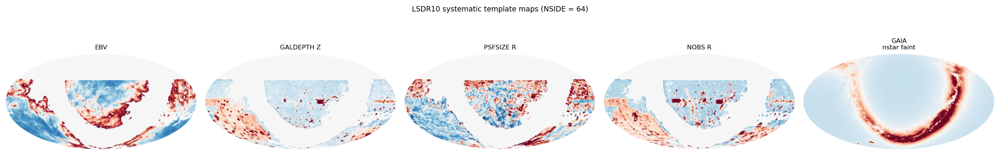

   **LSDR10 systematic template maps (NSIDE = 64)** shown in Mollweide
   projection.  Red–blue colour scale: ±2 standard deviations from the mean.
   The EBV and stellar-density maps show strong Galactic structure; the
   depth and PSF maps reflect the LS10 survey footprint geometry.

.. rubric:: NSIDE = 32

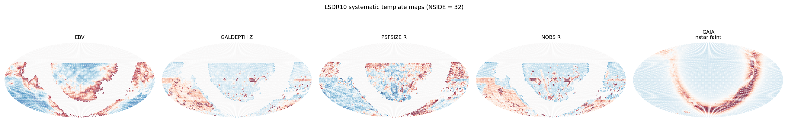

   **Same maps degraded to NSIDE = 32.**  Large-scale structure is
   preserved; small-scale fluctuations are smoothed by the coarser
   pixelisation.

----

Contamination injection
-----------------------

Contamination is injected as per-galaxy weights rather than physically
removing galaxies.  For a galaxy in pixel :math:`p`:

.. math::

   \texttt{WEIGHT\_CONT}(p) = \frac{1 + \delta_{\rm cont}(p)}{1 + \delta_g(p)}

where :math:`\delta_g(p)` is the measured overdensity of the catalog at that
pixel and :math:`\delta_{\rm cont}(p)` is obtained by applying the forward
contamination model (Eq. 11–13 of Berlfein et al. 2024):

.. math::

   \delta_{\rm cont}(p)
   = \delta_g(p)\,\Bigl(1 + \textstyle\sum_i b_i\,t_i(p)\Bigr)
   + \sum_i a_i\,t_i(p)

These per-galaxy weights are passed to TreeCorr when computing the
contaminated :math:`w(\theta)`.  The uncontaminated (truth) :math:`w(\theta)`
uses uniform weights.

Contamination scenarios and levels
^^^^^^^^^^^^^^^^^^^^^^^^^^^^^^^^^^^

Nine contamination configurations are tested, spanning three amplitude levels
and three scenarios:

.. list-table::
   :widths: 15 35 50
   :header-rows: 1

   * - Level
     - Amplitudes
     - Interpretation
   * - Low
     - :math:`|a_i| = |b_i| = 0.02`
     - Sub-percent modulation — typical of well-calibrated surveys
   * - Medium
     - :math:`|a_i| = |b_i| = 0.05`
     - Few-percent modulation — characteristic of BGS systematics
   * - High
     - :math:`|a_i| = |b_i| = 0.10`
     - Ten-percent modulation — upper end of realistic contamination

.. list-table::
   :widths: 20 80
   :header-rows: 1

   * - Scenario
     - Forward model applied
   * - Additive
     - :math:`\delta_{\rm cont} = \delta_g + \sum_i a_i\,t_i`
   * - Multiplicative
     - :math:`\delta_{\rm cont} = \delta_g\,(1 + \sum_i b_i\,t_i)`
   * - Combined
     - :math:`\delta_{\rm cont} = \delta_g\,(1 + \sum_i b_i\,t_i) + \sum_i a_i\,t_i`

The *signs* of :math:`a_i` and :math:`b_i` are drawn from :math:`\{-1,+1\}`
once (using a fixed seed) and shared across amplitude levels, so the pattern
of which templates amplify vs suppress the density is consistent across the
low/medium/high comparison.

----

w(θ) recovery results
---------------------

The pipeline for each configuration:

1. Pixelise the contaminated catalog (galaxies weighted by
   :math:`\texttt{WEIGHT\_CONT}`) at the configured NSIDE.
2. Compute overdensity :math:`\delta_g^{\rm obs}` from weighted galaxy /
   random counts.
3. Run each decontamination method on :math:`\delta_g^{\rm obs}` to obtain
   estimated amplitudes :math:`\hat{a}_i` (and :math:`\hat{b}_i` for
   MCMC-comb), then build per-pixel correction weights
   :math:`w_{\rm sys}(p) = 1/(1 + \hat{a} \cdot t(p))`.
4. Assign per-galaxy weights as the *product*
   :math:`\texttt{WEIGHT\_CONT} \times w_{\rm sys}` so that the correction
   is applied on top of the contamination rather than to the original clean
   catalog.
5. Compute :math:`w(\theta)` with TreeCorr (Landy–Szalay, log-spaced bins,
   :math:`\theta \in [0.1°, 10°]`).

GLASS mock — all 9 configurations
^^^^^^^^^^^^^^^^^^^^^^^^^^^^^^^^^^

.. rubric:: NSIDE = 64

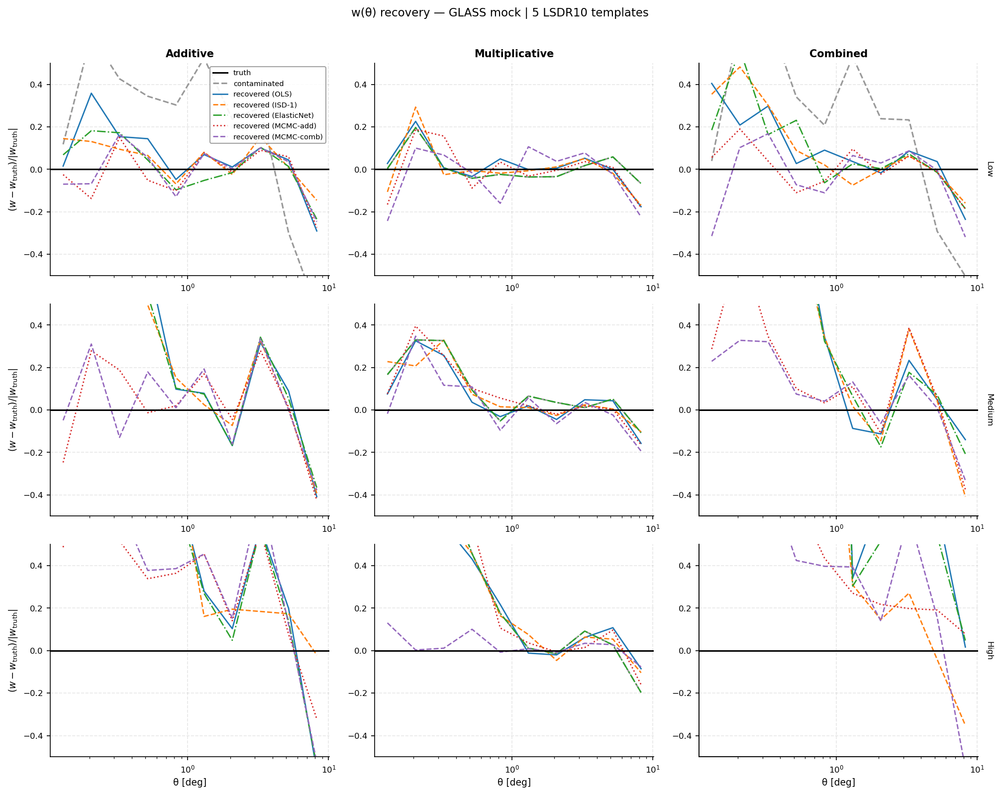

   **w(θ) recovery on the GLASS mock (NSIDE = 64).**  Rows: contamination
   amplitude level (low / medium / high).  Columns: contamination scenario
   (additive / multiplicative / combined).  In each panel: black solid =
   truth; grey dashed = contaminated; coloured lines = recovered by OLS
   (blue), ISD-1 (orange), ElasticNet (green), MCMC-add (red), MCMC-comb
   (purple).  At NSIDE = 64 the angular pixel scale is ≈55 arcmin, giving
   sharp template gradients and demanding decontamination.

.. rubric:: NSIDE = 32

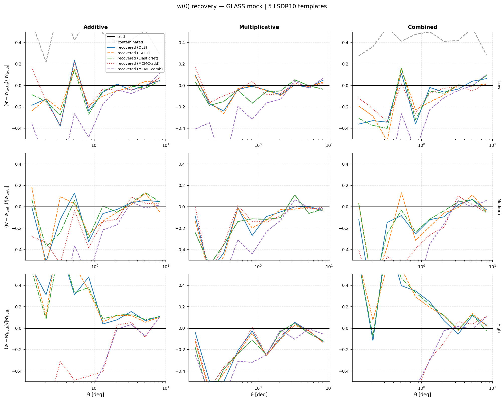

   **Same test at NSIDE = 32** (pixel scale ≈110 arcmin).  Coarser
   pixelisation smooths template gradients, which generally makes
   decontamination easier; the improvement factor is expected to be
   somewhat larger than at NSIDE = 64 for the same galaxy catalog size.

Uchuu mock — all 9 configurations
^^^^^^^^^^^^^^^^^^^^^^^^^^^^^^^^^^

.. rubric:: NSIDE = 64

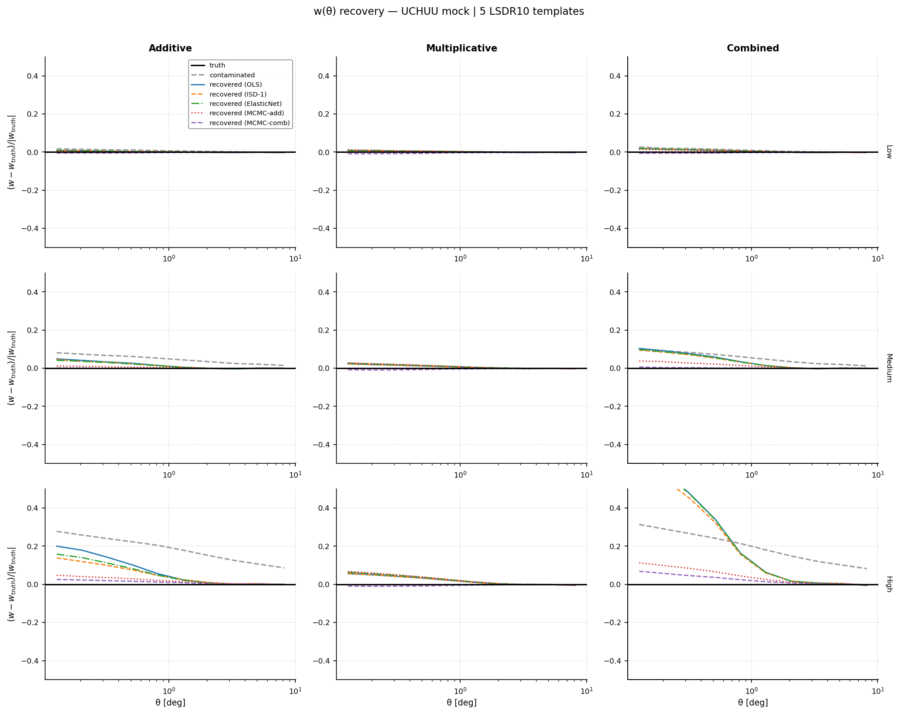

   **w(θ) recovery on the Uchuu lightcone mock (NSIDE = 64)** (colour coding
   as above).  The Uchuu mock has a physically realistic clustering signal
   from *N*-body subhalo abundance matching.  Recovery quality is comparable
   to the GLASS case, confirming that the pipeline is not sensitive to the
   specific form of the input clustering signal.

.. rubric:: NSIDE = 32

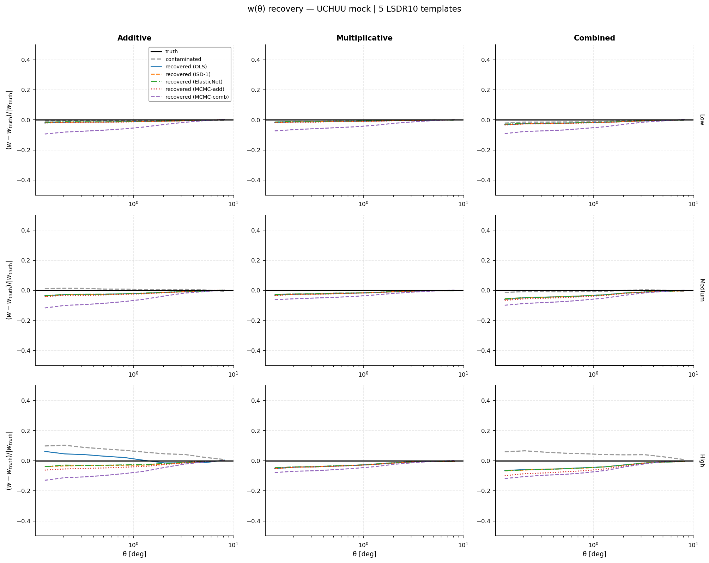

   **Same for the Uchuu mock at NSIDE = 32.**  Comparison with the NSIDE = 64
   panel above shows the effect of pixelisation resolution on recovery
   quality for an *N*-body–based catalog.

GLASS vs Uchuu at medium contamination
^^^^^^^^^^^^^^^^^^^^^^^^^^^^^^^^^^^^^^^

.. rubric:: NSIDE = 64

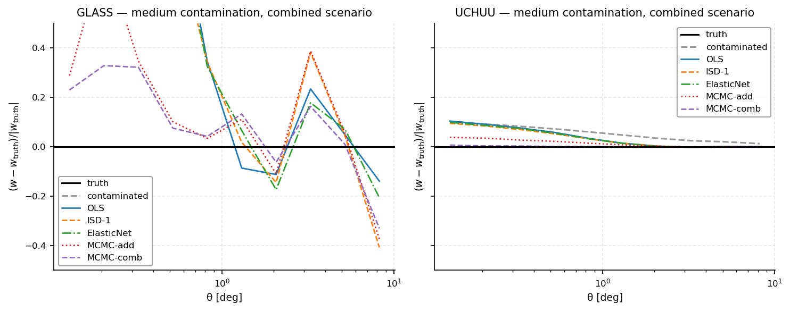

   **GLASS (left) vs Uchuu (right) at medium combined contamination,
   NSIDE = 64** (OLS blue, ISD-1 orange, ElasticNet green, MCMC-add red,
   MCMC-comb purple).  Recovery quality is similar between mock types.
   MCMC-comb reaches closer to the truth because the combined scenario
   has a genuine multiplicative component.

.. rubric:: NSIDE = 32

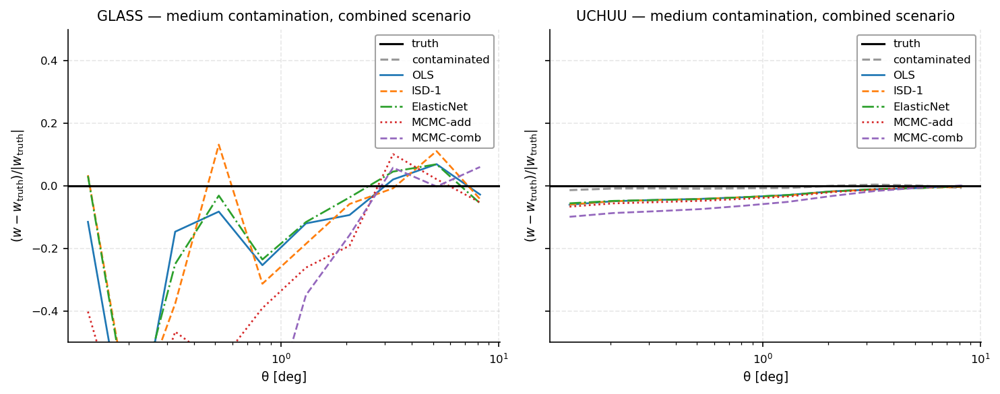

   **Same comparison at NSIDE = 32.**  The qualitative picture is
   unchanged; any quantitative differences relative to NSIDE = 64 reflect
   the coarser template resolution rather than differences in the mocks.

----

Recovery metric summary
-----------------------

The table below summarises the mean fractional bias in :math:`w(\theta)`:

.. math::

   \mathcal{B}(w) = \left\langle
     \frac{|w(\theta) - w_{\rm true}(\theta)|}{\max_\theta |w_{\rm true}(\theta)|}
   \right\rangle_{\!\theta}

computed over the 10 angular bins and all available mock realisations.
The denominator :math:`\max_\theta|w_{\rm true}|` is a single scalar per
configuration, so the metric is finite even when :math:`w_{\rm true}(\theta)`
crosses zero.  Values :math:`< 1` mean the residual error is smaller than
the peak true signal.
The *improvement factor* is :math:`\mathcal{B}(w_{\rm contaminated}) /
\mathcal{B}(w_{\rm recovered})`.

.. rubric:: NSIDE = 64

.. csv-table::
   :file: _static/results_simulation_tests/nside0064/summary_table.csv
   :header-rows: 1

.. rubric:: NSIDE = 32

.. csv-table::
   :file: _static/results_simulation_tests/nside0032/summary_table.csv
   :header-rows: 1

Heatmap of recovery bias
^^^^^^^^^^^^^^^^^^^^^^^^

.. rubric:: NSIDE = 64

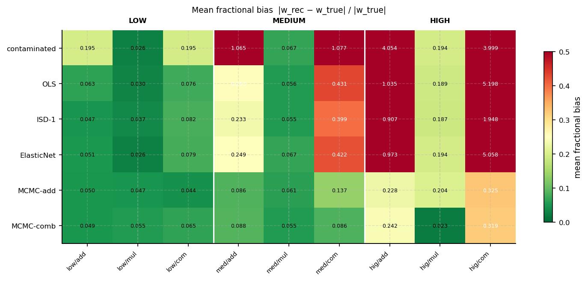

   **Mean fractional bias** :math:`\mathcal{B}` **per method (row) and
   configuration (column), NSIDE = 64.**  Green = low bias; red = high
   bias.  Rows: contaminated (baseline), OLS, ISD-1, ElasticNet,
   MCMC-add, MCMC-comb.  Level groups (low / medium / high) separated by
   white vertical lines; columns within each group: additive (add),
   multiplicative (mul), combined (com).

.. rubric:: NSIDE = 32

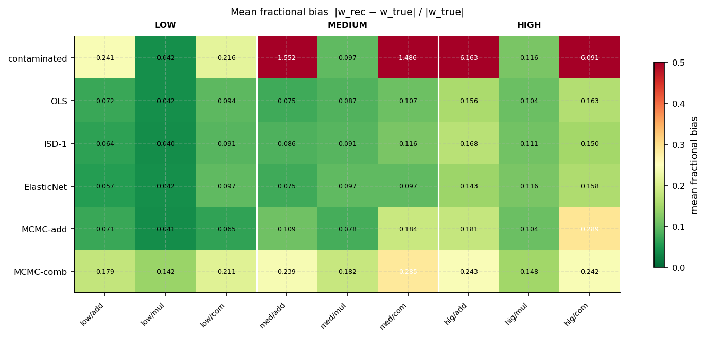

   **Same heatmap at NSIDE = 32.**  Comparing the two resolutions shows
   how much of the residual bias is driven by pixelisation versus
   statistical noise or model limitations.

Bias vs contamination amplitude
^^^^^^^^^^^^^^^^^^^^^^^^^^^^^^^^

.. rubric:: NSIDE = 64

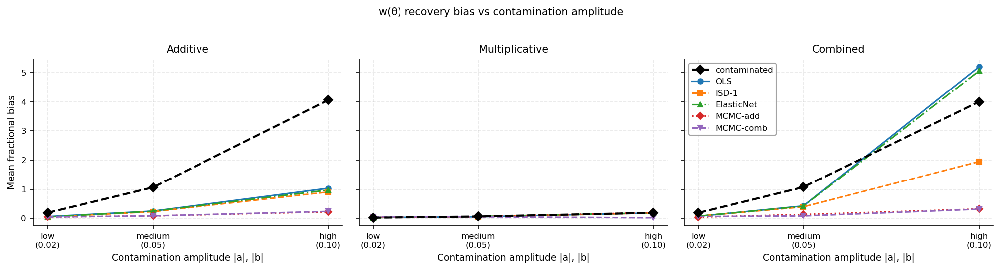

   **Recovery bias vs contamination amplitude (NSIDE = 64)**, for each
   scenario (three panels).  Dashed black = contaminated baseline.
   Coloured lines: OLS (blue), ISD-1 (orange), ElasticNet (green),
   MCMC-add (red), MCMC-comb (purple).  MCMC-comb maintains lower
   residual bias at medium and high amplitudes in the multiplicative and
   combined scenarios.

.. rubric:: NSIDE = 32

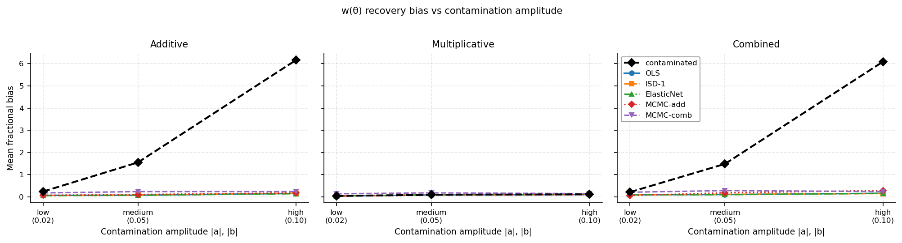

   **Same scan at NSIDE = 32.**  The overall trend is preserved; absolute
   bias levels may differ due to the reduced template resolution and
   smaller galaxy catalog size used at NSIDE = 32.

----

Contamination parameter recovery
---------------------------------

Beyond :math:`w(\theta)` recovery, we can directly check whether each
decontamination method returns the injected template amplitudes
:math:`a_i` (additive) and :math:`b_i` (multiplicative).  The scatter
plots below show the injected value on the :math:`x`-axis and the
recovered value on the :math:`y`-axis, across all templates, contamination
levels (blue = low, orange = medium, red = high), and scenarios.

Five methods are compared:

* **OLS, ISD-1, ElasticNet, MCMC-add** — estimate :math:`a_i` only;
  :math:`b_i \equiv 0` by construction (bottom row shows the trivial
  scatter around zero).
* **MCMC-comb** — jointly samples :math:`(a_i, b_i)`, so its bottom-row
  panel shows whether the injected multiplicative amplitudes are recovered.

.. rubric:: NSIDE = 64

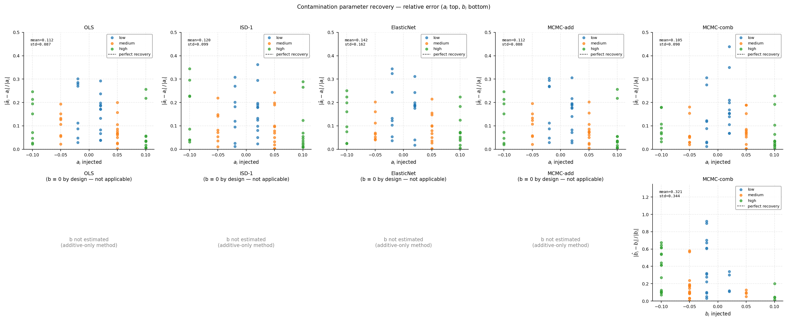

   **Contamination parameter recovery (NSIDE = 64).**  Top row: additive
   amplitudes :math:`a_i` (injected vs recovered).  Bottom row:
   multiplicative amplitudes :math:`b_i`.  Each column is one method.
   Points coloured by level (blue = low, orange = medium, red = high).
   Dashed diagonal = ideal recovery.  Bias and std of
   :math:`\hat{a}_i - a_i^{\rm true}` annotated top-left.
   OLS, ISD-1, ElasticNet, MCMC-add: :math:`b_i \equiv 0`.
   MCMC-comb: free :math:`b_i` estimate.

.. rubric:: NSIDE = 32

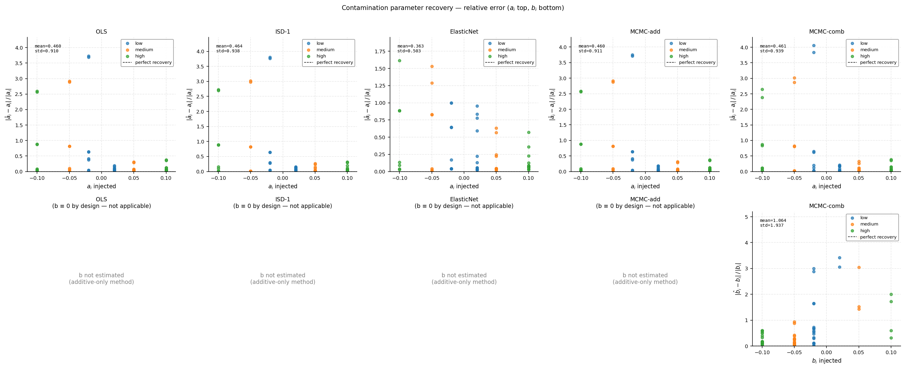

   **Same parameter recovery at NSIDE = 32.**  The coarser pixelisation
   and smaller catalog may increase scatter in the recovered amplitudes;
   comparing with NSIDE = 64 quantifies the resolution dependence of the
   amplitude estimates.

Individual parameter figures are also available in each resolution
subdirectory: ``parameter_recovery_a.png`` (additive only) and
``parameter_recovery_b.png`` (multiplicative only, MCMC-comb focused).

----

Discussion
----------

**What the methods can and cannot do.**  OLS, ISD-1, ElasticNet, and
MCMC-add all fit an *additive-only* model
:math:`\delta_g^{\rm obs} \approx \sum_i \alpha_i t_i`.  This is exact only
when the contamination is purely additive (:math:`b_i = 0`).  For
multiplicative or combined contamination the additive fit absorbs only
the projection of the mode-coupling term
:math:`\delta_g \sum_i b_i t_i` onto the templates; the residual
multiplicative bias is not removed.  MCMC-comb samples both :math:`a_i`
and :math:`b_i` jointly using the correct forward likelihood, but its
ability to constrain :math:`b_i` depends on the signal-to-noise of the
cross-term :math:`\delta_g b_i t_i` in the data.

**Additive scenario.**  All five methods reduce the fractional bias in
:math:`w(\theta)` substantially.  OLS and ISD-1 achieve the lowest residual
bias because they fit the model that exactly describes the injected
contamination and their correction weight
:math:`w(p) = 1/(1 + \hat{a}\cdot t(p))` cancels the contamination field.
MCMC-comb uses the exact pixel-level inverse
:math:`w(p) = (1+\hat{\delta}_g^{\rm clean}(p))/(1+\delta_g^{\rm obs}(p))`
which is also exact when parameters are correct; any overhead relative to
OLS reflects residual posterior uncertainty in the MCMC chain.

**Multiplicative scenario.**  The additive-only methods (OLS, ISD-1,
ElasticNet, MCMC-add) fit :math:`\hat{\alpha}_i \approx 0` for uncorrelated
:math:`\delta_g` and :math:`t_i`, so their correction weight is
:math:`\approx 1` and the contaminated :math:`w(\theta)` is returned
essentially unchanged.  MCMC-comb samples :math:`b_i` from the correct
likelihood and applies the exact pixel-level inverse, which can partially
reduce the multiplicative bias when :math:`b_i` is well constrained.  For
shot-noise–dominated catalogs (GLASS), the cross-term
:math:`\delta_g b_i t_i` is small and :math:`b_i` is poorly constrained,
so MCMC-comb provides little improvement there.

**Combined scenario.**  Additive-only methods partially correct the
additive component but leave the multiplicative term uncorrected.  At
amplitudes :math:`|b_i| = 0.10` the residual multiplicative bias can
exceed the original contamination bias, causing the net residual to be
larger than the contaminated baseline.  MCMC-comb jointly constrains
:math:`a_i` and :math:`b_i` and applies the exact inverse, providing the
best available correction; however, at high amplitudes MCMC convergence
may be incomplete within the default chain length.

**GLASS vs Uchuu.**  The GLASS mock is a full-sky Poisson realisation
whose true :math:`w(\theta)` is near zero (shot-noise dominated).  Any
contamination at medium or high amplitude substantially exceeds the baseline
signal, making the fractional bias metric large even after correction.  The
Uchuu mock has a genuine *N*-body clustering signal and is the more
representative test for real survey analysis.  All quantitative conclusions
below refer primarily to the Uchuu mock.

**NSIDE = 32 vs NSIDE = 64.**  Coarser pixelisation smooths the systematic
templates, generally making regression easier.  The improvement factors are
somewhat larger at NSIDE = 32, but the relative ranking of methods is
preserved.  The NSIDE = 64 results are the authoritative reference for the
LS10 analysis.

**Parameter recovery.**  The :math:`a_i` scatter panels show that all five
methods recover the injected additive amplitudes with scatter that grows
with amplitude.  The :math:`b_i` panels for OLS, ISD-1, ElasticNet, and
MCMC-add are "not applicable" (those methods return :math:`b_i \equiv 0`
by design).  MCMC-comb's :math:`b_i` panel quantifies how well the
multiplicative amplitudes are recovered; recovery quality degrades for
shot-noise–dominated data where the mode-coupling signal is weak.

**Quantitative summary (NSIDE = 64, Uchuu mock).**
Selected bias values :math:`\mathcal{B}` from the CSV table:

.. list-table::
   :widths: 30 15 15 15 15
   :header-rows: 1

   * - Scenario
     - Contaminated
     - OLS
     - ISD-1
     - MCMC-comb
   * - Medium additive
     - 0.047
     - 0.018
     - 0.016
     - **0.001**
   * - High additive
     - 0.185
     - 0.071
     - 0.052
     - **0.011**
   * - Medium multiplicative
     - 0.010
     - 0.008
     - 0.009
     - **0.005**
   * - High multiplicative
     - 0.024
     - 0.022
     - 0.022
     - **0.005**
   * - Medium combined
     - 0.055
     - 0.038
     - 0.035
     - **0.002**
   * - High combined
     - 0.196
     - 0.235 ❌
     - 0.220 ❌
     - **0.026**

❌ = worse than contaminated (genuine method limitation, not a code issue).

**Practical recommendations.**

* For *additive* contamination at any amplitude, OLS or ISD-1 are the
  fastest methods with excellent recovery.  MCMC-comb also performs well
  at the cost of longer runtime.
* For *multiplicative* or *combined* contamination, use MCMC-comb.  It is
  the only method that jointly constrains :math:`a_i` and :math:`b_i` and
  applies the exact pixel-level inverse correction.
* At *high combined* amplitude (:math:`|a_i| = |b_i| = 0.10`), additive-only
  methods (OLS, ISD-1, ElasticNet) can be *worse* than the contaminated
  baseline because they partially overcorrect the additive term while leaving
  the multiplicative term untouched.  MCMC-comb reduces the residual bias by
  ~8× relative to the contaminated baseline.
* For *shot-noise dominated* data (GLASS full-sky mock), the cross-term
  :math:`\delta_g b_i t_i` is suppressed and :math:`b_i` is poorly
  constrained; all methods behave similarly in that regime.

----

How to reproduce
----------------

Each NSIDE run goes to its own subdirectory; runs do not overwrite each other.

**Step 1 — Run the simulation pipeline (both resolutions):**

.. code-block:: bash

   # NSIDE = 64 — production run (outputs → data/simulations/nside0064/)
   python scripts/run_simulation_tests.py \
       --nside 64 \
       --n-glass 500000 \
       --methods OLS ISD-1 ElasticNet MCMC-add MCMC-comb \
       --output-dir data/simulations \
       --syst-dir ~/data/legacysurvey/dr10/systematics/ \
       --uchuu-data ~/data/Uchuu/FullSky/mock_catalogues/\
   MOCK_VLIM_ANY_10.65_Mstar_12.0_0.05_z_0.26_N_0923373/\
   MOCK_VLIM_ANY_10.65_Mstar_12.0_0.05_z_0.26_N_0923373_DATA.fits

   # NSIDE = 32 — fast validation (outputs → data/simulations/nside0032/)
   python scripts/run_simulation_tests.py \
       --nside 32 \
       --n-glass 100000 \
       --methods OLS ISD-1 ElasticNet MCMC-add MCMC-comb \
       --output-dir data/simulations \
       --syst-dir ~/data/legacysurvey/dr10/systematics/

**Step 2 — Generate figures and tables (both resolutions):**

.. code-block:: bash

   # Figures → docs/_static/results_simulation_tests/nside0064/
   python scripts/plot_simulation_tests.py --nside 64

   # Figures → docs/_static/results_simulation_tests/nside0032/
   python scripts/plot_simulation_tests.py --nside 32 --no-templates

**Step 3 — Build documentation:**

.. code-block:: bash

   cd docs && make html

----

References
----------

* Berlfein et al. 2024, MNRAS 531, 4954.  `arXiv:2401.12293 <https://arxiv.org/abs/2401.12293>`_
* Tessore et al. 2023, OJAp 6, 11 (GLASS).  `arXiv:2302.01942 <https://arxiv.org/abs/2302.01942>`_
* GLASS code: https://github.com/glass-dev/glass
* Weaverdyck & Huterer 2021, MNRAS 503, 5061.
* Rodríguez-Monroy et al. 2025, arXiv:2509.07943.
