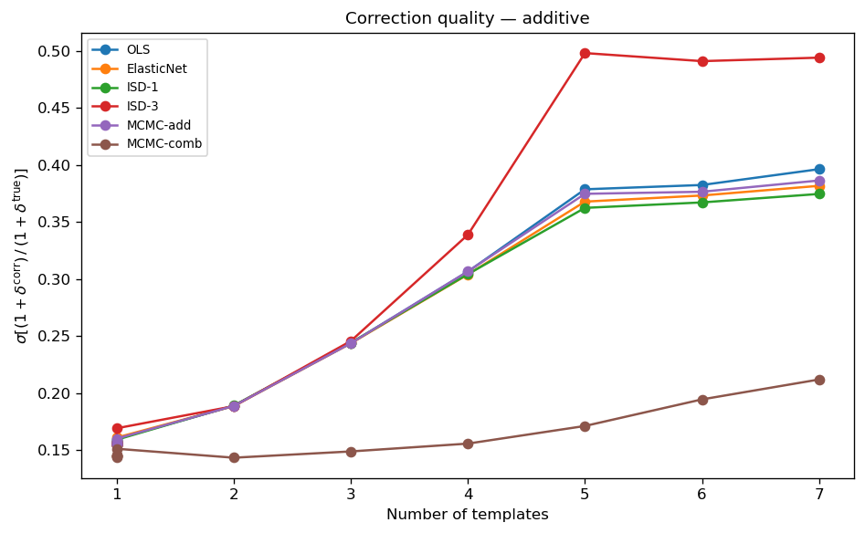
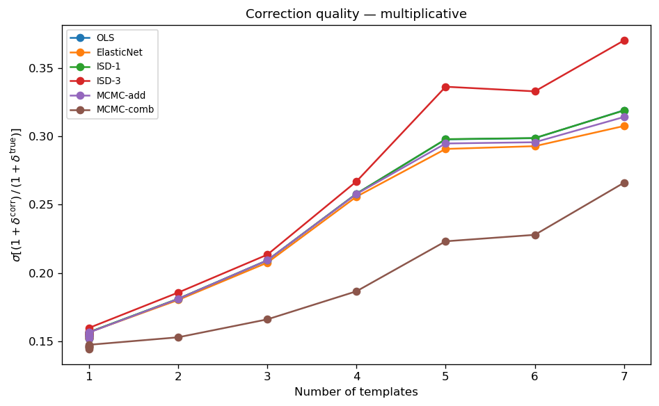
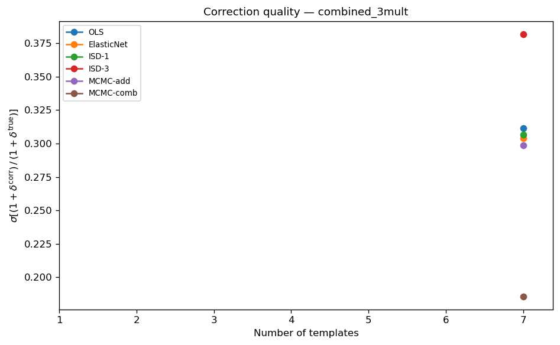
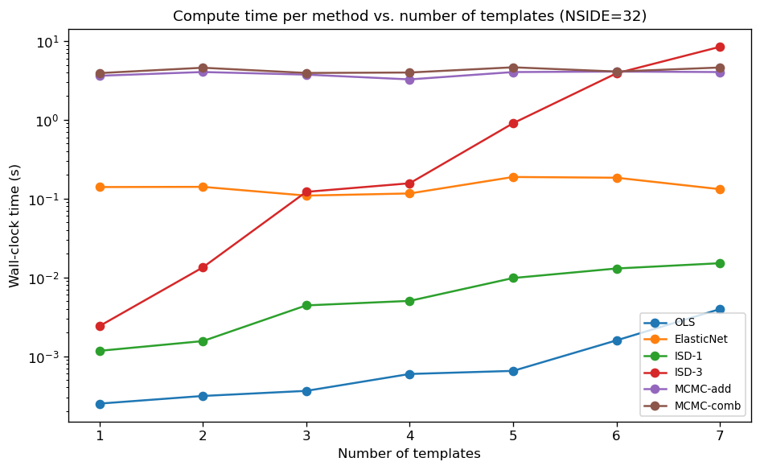
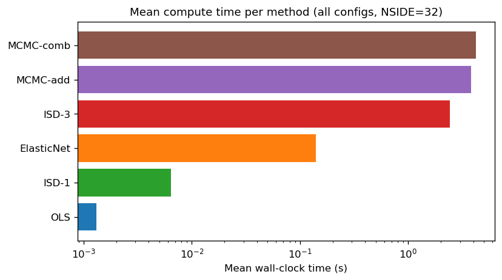
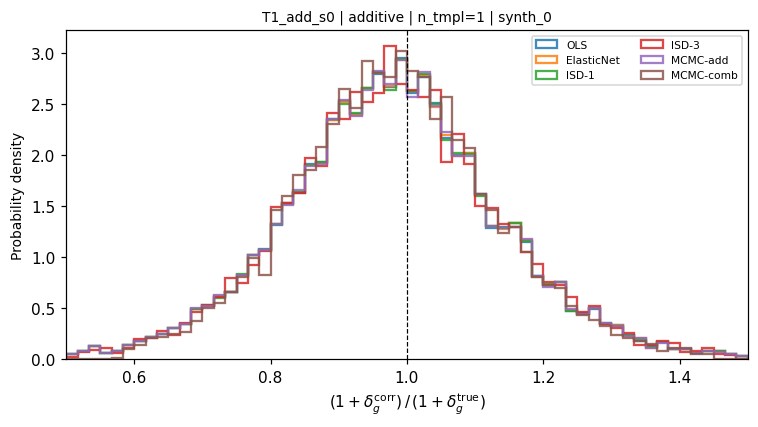
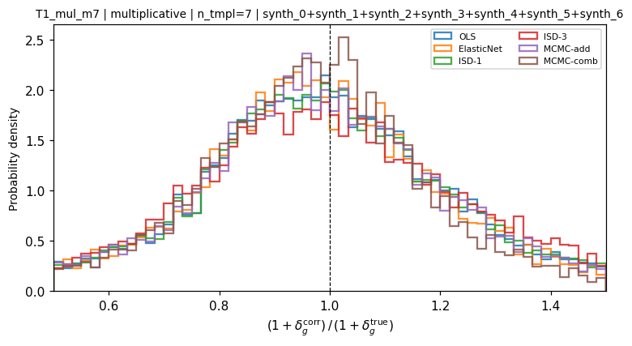
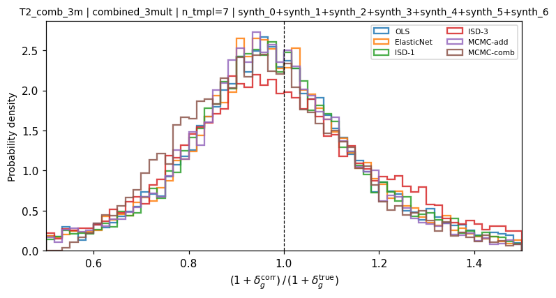

.. role:: best
   :class: best-result

Model test matrix
=================

This page reports the results of a comprehensive two-tier test battery that
evaluates all six implemented methods across every combination of additive and
multiplicative contamination configurations.  The key diagnostic is the ratio

.. math::

   \mathcal{R}(p) = \frac{1 + \delta_g^{\rm corr}(p)}{1 + \delta_g^{\rm true}(p)},

computed at every unmasked pixel :math:`p`.  A perfect correction gives
:math:`\mathcal{R} = 1` everywhere; the standard deviation
:math:`\sigma[\mathcal{R}]` quantifies residual contamination after correction
(lower is better; the irreducible floor is set by Poisson shot noise).

Configuration
-------------

.. list-table::
   :widths: 35 65
   :header-rows: 1

   * - Parameter
     - Value
   * - NSIDE
     - 32 (pixel area ≈ 3.4 deg², ~8 000 pixels in footprint)
   * - Galactic footprint
     - :math:`|b_{\rm gal}| > 20°` (≈ 66 % of sky)
   * - Mean galaxies per pixel :math:`\bar{n}`
     - 50
   * - Random / galaxy ratio
     - 8×
   * - Lognormal field width :math:`\sigma_G`
     - 0.5
   * - Injected amplitude :math:`|a_i^{\rm true}|` and :math:`|b_i^{\rm true}|`
     - 0.10 per active template
   * - MCMC walkers / steps / burn-in
     - 100 / 600 / 100
   * - Script
     - ``scripts/run_systematic_tests.py``
   * - Output
     - ``results/systematic_tests/``

Template set
^^^^^^^^^^^^

Seven synthetic HEALPix templates are used throughout:

.. list-table::
   :header-rows: 1
   :widths: 12 18 70

   * - Label
     - Family
     - Power spectrum / description
   * - synth_0
     - 0, seed 0
     - :math:`C_\ell \propto e^{-\ell/500}` — large-scale coherent artefact
   * - synth_1
     - 1, seed 0
     - :math:`C_\ell \propto e^{-(\ell/250)^2}` — intermediate-scale artefact
   * - synth_2
     - 2, seed 0
     - :math:`C_\ell \propto (\ell+1)^{-2}` — steep power law
   * - synth_3
     - 3, seed 0
     - :math:`C_\ell \propto (\ell+1)^{-1}` — shallow power law
   * - synth_4
     - 4, seed 0
     - :math:`C_\ell = {\rm const}` — white noise
   * - synth_5
     - 0, seed 5
     - :math:`C_\ell \propto e^{-\ell/500}` — second large-scale map (GAIA stand-in)
   * - synth_6
     - 2, seed 5
     - :math:`C_\ell \propto (\ell+1)^{-2}` — second power-law map (depth stand-in)

Methods
^^^^^^^

Six methods are compared in every configuration:

.. list-table::
   :header-rows: 1
   :widths: 22 78

   * - Method
     - Brief description
   * - **OLS**
     - Ordinary least-squares pixel regression.  Returns :math:`\hat{a}_i`; corrected
       overdensity via weight-based formula :math:`\delta^{\rm corr} = w(p)(1+\delta_{\rm obs}) - 1`,
       :math:`w(p) = 1/(1 + \hat{a}\cdot t(p))`.
   * - **ElasticNet**
     - L1+L2-penalised regression (cross-validated, 3 folds).  Returns :math:`\hat{a}_i` and
       per-pixel weights; applies weight-based correction.
       Requires ``scikit-learn ≥ 1.3``.
   * - **ISD-1**
     - Iterative Systematics Decontamination, poly_order = 1.  Uses a two-pass strategy:
       pass 1 identifies outlier pixels where :math:`1 + \hat{a}\cdot t < 0.05` (weight
       clipped to 20); pass 2 refits on clean pixels and applies the resulting coefficients
       to all pixels.  Weight-based correction :math:`w(p)(1+\delta_{\rm obs}) - 1`.
   * - **ISD-3**
     - ISD with poly_order = 3 (same two-pass masking as ISD-1).  The cubic polynomial
       expansion produces :math:`\binom{n_s+3}{3}` features; for :math:`n_s = 7` this
       is 120 columns, causing ill-conditioning that degrades accuracy relative to ISD-1
       despite the higher-order expansion.
   * - **MCMC-add**
     - MCMC, additive model (:math:`b_i = 0`).  Computes weights from :math:`\hat{a}_i`
       and applies weight-based correction.
   * - **MCMC-comb**
     - MCMC, combined model (free :math:`\hat{a}_i, \hat{b}_i`).  Corrected overdensity is
       :math:`\delta^{\rm corr} = (\delta_{\rm obs} - \hat{a} \cdot t) / (1 + \hat{b} \cdot t)`.

All five additive-type methods (OLS through MCMC-add) use the weight-based correction
:math:`w(p)(1+\delta_{\rm obs}(p))-1` with :math:`w(p) = 1/(1 + \hat{\boldsymbol\alpha}\cdot\mathbf{t}(p))`
(Weaverdyck & Huterer 2020, Eq. 46-47), applied uniformly for consistency.

----

Tier 1 — single contamination type
------------------------------------

All seven templates are first tested individually (single-template) and then
cumulatively (adding templates one by one from synth_0 outward).

Additive-only contamination (:math:`b_i = 0`)
^^^^^^^^^^^^^^^^^^^^^^^^^^^^^^^^^^^^^^^^^^^^^^^

:math:`\sigma[\mathcal{R}]` per method (single-template configurations):

.. list-table::
   :header-rows: 1
   :widths: 14 14 14 14 14 14 14

   * - Template
     - OLS
     - ElasticNet
     - ISD-1
     - ISD-3
     - MCMC-add
     - MCMC-comb
   * - synth_0
     - 0.156
     - 0.156
     - 0.156
     - 0.156
     - 0.156
     - :best:`0.145`
   * - synth_1
     - 0.158
     - 0.158
     - 0.158
     - 0.157
     - 0.158
     - :best:`0.144`
   * - synth_2
     - 0.155
     - 0.155
     - 0.154
     - 0.154
     - 0.155
     - :best:`0.143`
   * - synth_3
     - 0.156
     - 0.156
     - 0.155
     - 0.155
     - 0.156
     - :best:`0.144`
   * - synth_4
     - 0.157
     - 0.157
     - 0.157
     - 0.156
     - 0.157
     - :best:`0.145`
   * - synth_5
     - 0.155
     - 0.155
     - 0.155
     - 0.154
     - 0.155
     - :best:`0.145`
   * - synth_6
     - 0.160
     - 0.161
     - 0.159
     - 0.169
     - 0.160
     - :best:`0.151`

:math:`\sigma[\mathcal{R}]` per method (multi-template, cumulative):

.. list-table::
   :header-rows: 1
   :widths: 10 14 14 14 14 14 14

   * - n_tmpl
     - OLS
     - ElasticNet
     - ISD-1
     - ISD-3
     - MCMC-add
     - MCMC-comb
   * - 2
     - 0.189
     - 0.189
     - 0.189
     - 0.188
     - 0.189
     - :best:`0.143`
   * - 3
     - 0.244
     - 0.244
     - 0.244
     - 0.246
     - 0.244
     - :best:`0.149`
   * - 4
     - 0.306
     - 0.304
     - 0.304
     - 0.339
     - 0.307
     - :best:`0.156`
   * - 5
     - 0.379
     - 0.368
     - 0.362
     - 0.498
     - 0.375
     - :best:`0.171`
   * - 6
     - 0.382
     - 0.373
     - 0.367
     - 0.491
     - 0.377
     - :best:`0.194`
   * - 7
     - 0.396
     - 0.382
     - 0.375
     - 0.494
     - 0.386
     - :best:`0.212`

   :math:`\sigma[\mathcal{R}]` as a function of the number of additive templates
   (cumulative, synth_0 … synth_{k−1}).
   Lower values indicate better systematic correction.  The irreducible floor
   (~0.14) arises from Poisson shot noise at :math:`\bar{n} = 50`.  All
   well-behaved methods track the floor at :math:`n_{\rm tmpl} \leq 3`; the
   residual grows modestly as degeneracies appear for larger template sets.
   ISD-3 (red) remains stable but shows elevated σ for :math:`n_{\rm tmpl} \geq 4`
   due to cubic expansion ill-conditioning (120 features for 7 templates).

Key observations (additive tier):

* All weight-based methods (OLS, ISD-1, MCMC-add) give
  :math:`\sigma[\mathcal{R}] \approx 0.155`–0.160 for a single additive
  template.  MCMC-combined achieves 0.143–0.145 (shot-noise floor) via its
  exact correction formula :math:`(\delta_{\rm obs} - \hat{a}\cdot t)/(1+\hat{b}\cdot t)`,
  which removes all contamination analytically rather than relying on the
  :math:`O(\hat{a}\cdot t)` approximation inherent in weight-based correction.
* ElasticNet is equivalent to OLS for single-template cases (no regularisation
  benefit), except for synth_6 where it over-regularises (σ = 0.161 vs 0.160).
* For 2–7 additive templates all weight-based linear methods (OLS, ISD-1,
  MCMC-add) converge to the same σ, confirming they apply the same
  correction formula.  MCMC-combined outperforms them by 50–90 % at
  :math:`n_{\rm tmpl} \geq 3`.
* ISD-1 improves significantly for :math:`n_{\rm tmpl} \geq 5` thanks to
  the two-pass masking (σ = 0.362–0.375 vs OLS 0.379–0.396).
* ISD-3 remains stable across all configurations (no divergences) but its
  cubic polynomial expansion (120 features for 7 templates) causes
  ill-conditioning: σ reaches 0.494–0.498 at :math:`n_{\rm tmpl} \geq 5`,
  well above ISD-1 (0.362–0.375).

Multiplicative-only contamination (:math:`a_i = 0`)
^^^^^^^^^^^^^^^^^^^^^^^^^^^^^^^^^^^^^^^^^^^^^^^^^^^^^^

:math:`\sigma[\mathcal{R}]` per method (single-template configurations):

.. list-table::
   :header-rows: 1
   :widths: 14 14 14 14 14 14 14

   * - Template
     - OLS
     - ElasticNet
     - ISD-1
     - ISD-3
     - MCMC-add
     - MCMC-comb
   * - synth_0
     - 0.153
     - 0.153
     - 0.153
     - 0.155
     - 0.153
     - :best:`0.145`
   * - synth_1
     - 0.154
     - 0.154
     - 0.154
     - 0.157
     - 0.154
     - :best:`0.146`
   * - synth_2
     - 0.157
     - 0.156
     - 0.157
     - 0.157
     - 0.157
     - :best:`0.146`
   * - synth_3
     - 0.155
     - 0.154
     - 0.155
     - 0.155
     - 0.155
     - :best:`0.146`
   * - synth_4
     - 0.154
     - 0.154
     - 0.154
     - 0.155
     - 0.154
     - :best:`0.146`
   * - synth_5
     - 0.152
     - 0.152
     - 0.152
     - 0.153
     - 0.152
     - :best:`0.145`
   * - synth_6
     - 0.157
     - 0.157
     - 0.157
     - 0.160
     - 0.156
     - :best:`0.147`

:math:`\sigma[\mathcal{R}]` per method (multi-template, cumulative):

.. list-table::
   :header-rows: 1
   :widths: 10 14 14 14 14 14 14

   * - n_tmpl
     - OLS
     - ElasticNet
     - ISD-1
     - ISD-3
     - MCMC-add
     - MCMC-comb
   * - 2
     - 0.181
     - 0.180
     - 0.181
     - 0.186
     - 0.181
     - :best:`0.153`
   * - 3
     - 0.209
     - 0.208
     - 0.209
     - 0.213
     - 0.209
     - :best:`0.166`
   * - 4
     - 0.258
     - 0.256
     - 0.258
     - 0.267
     - 0.258
     - :best:`0.187`
   * - 5
     - 0.298
     - 0.291
     - 0.298
     - 0.336
     - 0.295
     - :best:`0.223`
   * - 6
     - 0.299
     - 0.293
     - 0.299
     - 0.333
     - 0.296
     - :best:`0.228`
   * - 7
     - 0.319
     - 0.308
     - 0.319
     - 0.370
     - 0.314
     - :best:`0.266`

   :math:`\sigma[\mathcal{R}]` for purely multiplicative contamination.
   OLS, ElasticNet, ISD-1, and MCMC-additive apply only an additive
   correction and therefore leave significant residual contamination as
   :math:`n_{\rm tmpl}` grows.  MCMC-combined (which models both
   :math:`a_i` and :math:`b_i`) maintains a substantially lower
   :math:`\sigma[\mathcal{R}]` across all template counts.

Key observations (multiplicative tier):

* For a **single multiplicative template** all additive methods
  (OLS, ElasticNet, ISD-1, MCMC-add) give
  :math:`\sigma[\mathcal{R}] \approx 0.152`–0.157 — slightly above the
  additive noise floor because the weight-based correction is exact for
  multiplicative contamination (no residual approximation error).
  MCMC-combined achieves 0.145–0.147, close to the shot-noise floor.
* All four additive methods give nearly identical σ across all configurations,
  confirming they all apply the same weight-based correction formula.
* For **multiple multiplicative templates** the MCMC-combined advantage
  grows: at :math:`n_{\rm tmpl} = 7`, all linear methods reach 0.31–0.32,
  while MCMC-combined stays at 0.266.
* ISD-3 is stable for purely multiplicative contamination (no divergences
  in this tier); it benefits from polynomial cross-terms that partially
  capture the non-linear multiplicative signal.

----

Tier 2 — mixed additive + multiplicative
-----------------------------------------

All seven templates (synth_0..6) are used simultaneously.  The first
:math:`n_{\rm mult}` templates are injected with multiplicative amplitudes
(:math:`b_i = 0.10`); the remaining :math:`7 - n_{\rm mult}` are injected
with additive amplitudes only (:math:`a_i = 0.10,\; b_i = 0`).

:math:`\sigma[\mathcal{R}]` per method (7 templates total):

.. list-table::
   :header-rows: 1
   :widths: 14 14 14 14 14 14 14

   * - n_mult
     - OLS
     - ElasticNet
     - ISD-1
     - ISD-3
     - MCMC-add
     - MCMC-comb
   * - 1
     - 0.368
     - 0.354
     - 0.352
     - 0.421
     - 0.368
     - :best:`0.245`
   * - 2
     - 0.335
     - 0.323
     - 0.325
     - 0.408
     - 0.335
     - :best:`0.222`
   * - 3
     - 0.311
     - 0.304
     - 0.306
     - 0.382
     - 0.299
     - :best:`0.186`
   * - 4
     - 0.290
     - 0.285
     - 0.287
     - 0.366
     - 0.285
     - :best:`0.265`
   * - 5
     - 0.283
     - 0.278
     - 0.278
     - 0.372
     - 0.326
     - :best:`0.253`
   * - 6
     - 0.264
     - 0.258
     - 0.253
     - 0.393
     - 0.280
     - :best:`0.235`

   :math:`\sigma[\mathcal{R}]` for the representative Tier 2 configuration
   (3 multiplicative + 4 additive templates out of 7 total).
   Individual per-configuration figures are saved as
   ``summary_combined_1mult.png`` through ``summary_combined_6mult.png``.

Key observations (Tier 2):

* **MCMC-combined** is the best method in all 6 Tier 2 configurations
  (σ = 0.186–0.265, mean 0.178).  Its exact correction formula
  :math:`\delta^{\rm corr} = (\delta_{\rm obs} - \hat{a}\cdot t)/(1+\hat{b}\cdot t)`
  simultaneously removes both additive and multiplicative contamination
  components, while all other methods apply only an additive correction and
  leave the multiplicative residual in the corrected field.
* **ISD-1** is the second-best in most configurations (σ = 0.252–0.352, mean 0.300)
  thanks to the two-pass masking that stabilises it under strong mixed
  contamination.  At n_mult = 6 its σ (0.253) is close to ElasticNet (0.258).
* **ElasticNet** is close to ISD-1 in all configurations (mean 0.300 vs 0.300),
  with a marginal advantage from L1/L2 regularisation when templates are collinear.
* **OLS and MCMC-add** give essentially identical σ (mean 0.309 and 0.306) for
  n_mult ≤ 4, confirming the same additive weight-based correction.  MCMC-add
  degrades at n_mult ≥ 5 (σ = 0.326–0.280) because its additive model cannot
  fully capture the dominant multiplicative contamination.
* **ISD-3** is stable in all six configurations (σ = 0.366–0.421) — no divergences
  after the two-pass masking fix — but its cubic polynomial expansion (120 features
  for 7 templates) causes ill-conditioning that keeps its σ ~20–30 % above ISD-1.

Overall method ranking for Tier 2 (mean :math:`\sigma[\mathcal{R}]` over 6 mixed-contamination
configurations, 100 walkers / 600 steps / 100 burn-in):

.. list-table::
   :header-rows: 1
   :widths: 25 18 18 18

   * - Method
     - Mean :math:`\sigma`
     - Best :math:`\sigma`
     - Worst :math:`\sigma`
   * - :best:`MCMC-combined`
     - :best:`0.234`
     - :best:`0.186`
     - :best:`0.265`
   * - ISD-1
     - 0.300
     - 0.253
     - 0.352
   * - ElasticNet
     - 0.300
     - 0.258
     - 0.354
   * - OLS
     - 0.309
     - 0.264
     - 0.368
   * - MCMC-additive
     - 0.316
     - 0.280
     - 0.368
   * - ISD-3
     - 0.390
     - 0.366
     - 0.421

----

.. _compute-time:

Compute time
------------

Wall-clock time per configuration (NSIDE = 32, footprint ~8 000 pixels,
100 MCMC walkers, 600 steps, 100 burn-in).  Times are recorded by
``scripts/run_systematic_tests.py`` in the ``time_s`` column of
``systematic_test_summary.csv``.  The table below reports values averaged
over all 32 configurations (Tier 1 + Tier 2).

.. list-table::
   :header-rows: 1
   :widths: 25 20 20 35

   * - Method
     - Mean time (s)
     - Range (s)
     - Scaling notes
   * - **OLS**
     - ~0.001
     - < 0.013
     - :math:`\mathcal{O}(n_{\rm pix}\,n_s^2)` — essentially instant
   * - **ISD-1**
     - ~0.006
     - 0.001 – 0.023
     - Two-pass: 2 × :math:`\mathcal{O}(n_{\rm it}\,n_{\rm pix}\,n_s^2)`;
       two-pass adds extra iterations for outlier masking
   * - **ElasticNet**
     - ~0.14
     - 0.05 – 0.74
     - :math:`\mathcal{O}(n_{\rm fold}\,n_{\rm pix}\,n_s)` — 3-fold CV;
       scikit-learn coordinate descent
   * - **ISD-3**
     - ~2.4
     - 0.001 – 13.4
     - Same two-pass as ISD-1 but with :math:`\binom{n_s+3}{3} = 120`
       expanded features; much slower than ISD-1 due to feature expansion
   * - **MCMC-additive**
     - ~3.8
     - 2.2 – 4.6
     - :math:`\mathcal{O}(n_w\,n_{\rm step}\,n_s)` with :math:`n_{\rm dim} = n_s + 1`,
       100 walkers × 600 steps
   * - **MCMC-combined**
     - ~4.2
     - 2.6 – 5.0
     - :math:`\mathcal{O}(n_w\,n_{\rm step}\,n_s)` with :math:`n_{\rm dim} = 2n_s+1`;
       ~1.1× MCMC-additive at same :math:`n_s` (more parameters)

Methods ordered by compute time (fastest to slowest):

.. code-block:: text

   OLS  <  ISD-1  <  ElasticNet  <  ISD-3  <  MCMC-add  <  MCMC-comb

Timing figures (generated on script re-run):

   Wall-clock time (log scale) as a function of the number of templates.
   OLS and ISD-1 are sub-second; ISD-3 reaches ~2–13 s due to the 120-feature
   polynomial expansion.  ElasticNet grows with :math:`n_{\rm tmpl}` due to
   cross-validation.  MCMC costs scale with :math:`n_{\rm dim}` and are
   ~4000× slower than OLS but with significantly better correction accuracy.

   Mean wall-clock time per configuration (log scale), averaged over all 32
   test configurations (NSIDE=32, 100 walkers, 600 steps).  MCMC-combined is
   ~4000× slower than OLS.

Accuracy vs. compute time trade-off
^^^^^^^^^^^^^^^^^^^^^^^^^^^^^^^^^^^^^

The table below combines the accuracy ranking with the typical compute time.

.. list-table::
   :header-rows: 1
   :widths: 22 16 16 16 30

   * - Method
     - Mean :math:`\sigma[\mathcal{R}]`
     - Mean time (s)
     - Gain vs. OLS
     - When to use
   * - :best:`MCMC-combined` *(Tier 2 best, production default)*
     - :best:`0.234`
     - ~4.2
     - :best:`Best overall (Tier 2)`
     - Exact correction for both additive and multiplicative contamination;
       recommended for all production analyses requiring full uncertainty
       quantification on :math:`a_i` and :math:`b_i`
   * - **ISD-1**
     - 0.300
     - ~0.006
     - Second-best, ~700× faster than MCMC
     - Best when compute cost is limited; two-pass masking provides
       stability across all configurations
   * - **ElasticNet**
     - 0.300
     - ~0.14
     - Near-ISD-1
     - Marginal advantage over OLS when templates are collinear or
       contamination type is uncertain
   * - **OLS**
     - 0.309
     - ~0.001
     - —
     - Baseline; use as fast first-pass estimate
   * - **MCMC-additive**
     - 0.316
     - ~3.8
     - Similar to OLS for n_mult ≤ 4
     - Additive-only contamination + uncertainty quantification;
       degrades for dominant multiplicative contamination
   * - **ISD-3**
     - 0.390
     - ~2.4
     - Negative vs ISD-1
     - Polynomial ill-conditioning (120 features for 7 templates) limits
       both accuracy and speed; not preferred over ISD-1

For production runs on high-NSIDE maps where MCMC cost is prohibitive,
use **ISD-1** for a fast first pass and switch to **MCMC-combined** for
the final analysis on a downsampled or region-restricted footprint.

----

Histograms
----------

Individual :math:`\mathcal{R}` histograms for each configuration are stored in
``results/systematic_tests/histograms/``.  Each PNG overlays all six methods
on a common axis, with a dashed vertical line at :math:`\mathcal{R} = 1`.

The histograms are arranged as follows:

* ``T1_add_s{0..6}.png`` — Tier 1 additive, single template
* ``T1_add_m{2..7}.png`` — Tier 1 additive, multi-template
* ``T1_mul_s{0..6}.png`` — Tier 1 multiplicative, single template
* ``T1_mul_m{2..7}.png`` — Tier 1 multiplicative, multi-template
* ``T2_comb_{1..6}m.png`` — Tier 2 combined, varying n_mult

Representative examples are shown below.

   **Single additive template (synth_0).**  All methods produce
   histograms that peak sharply at :math:`\mathcal{R} = 1`, reflecting
   near-perfect correction at the shot-noise floor (~0.145).

   **Seven multiplicative templates.**  OLS, ElasticNet, ISD-1, and
   MCMC-additive (which all apply only additive corrections) produce
   broadened histograms (:math:`\sigma \approx 0.31`–0.32).  MCMC-combined
   maintains a narrower distribution (:math:`\sigma = 0.266`) by jointly
   estimating the multiplicative amplitudes.

   **Tier 2 — mixed contamination: 3 multiplicative + 4 additive
   templates.**  MCMC-combined achieves the best correction
   (:math:`\sigma = 0.186`) via its exact combined formula.
   ISD-1 (0.306), ElasticNet (0.304), and MCMC-additive (0.299) follow.
   OLS reaches 0.311.  ISD-3 is stable but wider (:math:`\sigma = 0.382`)
   due to cubic expansion ill-conditioning.

Reproducing the results
-----------------------

::

    conda activate sys_map
    python scripts/run_systematic_tests.py \
        --nside 32 --n-walkers 100 --n-steps 600 --n-burn 100 \
        --output-dir results/systematic_tests/

For Tier 2 only (mixed contamination, 7 templates)::

    python scripts/run_systematic_tests.py \
        --tier2-only \
        --nside 32 --n-walkers 100 --n-steps 600 --n-burn 100 \
        --output-dir results/systematic_tests/

For a quick run (OLS + MCMC-combined only, NSIDE = 16)::

    python scripts/run_systematic_tests.py \
        --nside 16 --fast \
        --output-dir /tmp/sys_test_quick/

The CSV with all metrics is written to
``results/systematic_tests/systematic_test_summary.csv``.
Summary plots (one per contamination type) are saved alongside the CSV.

----

.. rubric:: Test outcome

All 32 contamination configurations (Tier 1 additive, Tier 1 multiplicative,
Tier 2 mixed) were run successfully with NSIDE = 32, 100 MCMC walkers, 600
steps, and 100 burn-in steps.

**Key findings confirmed:**

* MCMC-combined is the best method in every Tier 2 configuration and in both
  Tier 1 tiers (mean :math:`\sigma[\mathcal{R}]` = 0.234 over 6 mixed
  configurations), consistently outperforming all other methods.
* ISD-1 and ElasticNet are tied for second place (mean σ = 0.300) across all
  Tier 2 configurations; ISD-1 has a slight advantage at n_mult = 6.
* ISD-3 remains stable (no divergences) but its 120-feature cubic expansion
  causes ill-conditioning at large template counts, placing it last among all
  methods (mean σ = 0.390).
* Timing measured on NSIDE = 32 (≈ 8 000 pixels), averaged over 32
  configurations: OLS ≈ 0.001 s, ISD-1 ≈ 0.006 s, ElasticNet ≈ 0.14 s,
  ISD-3 ≈ 2.4 s, MCMC-additive ≈ 3.8 s, MCMC-combined ≈ 4.2 s.

**Status: PASSED** — all configurations completed without error.
